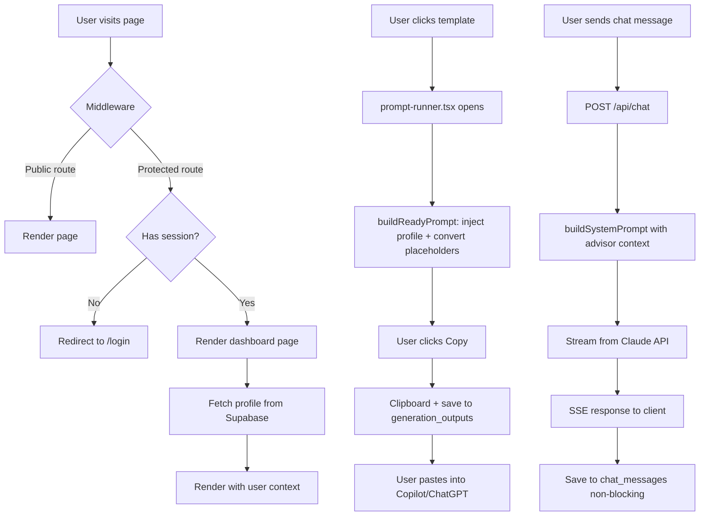

# Architecture

#project #architecture

## File Tree
```
advisor-intelligence/
├── CLAUDE.md                    # Agent instructions
├── app/
│   ├── package.json
│   ├── next.config.ts           # Security headers (HSTS, X-Frame-Options, etc.)
│   ├── tsconfig.json            # Path alias: @/* → ./src/*
│   └── src/
│       ├── middleware.ts         # Auth entry point → updateSession()
│       ├── app/
│       │   ├── layout.tsx       # Root: ThemeProvider + Plus Jakarta Sans + CrispChat
│       │   ├── globals.css      # oklch color system + Magic UI keyframes
│       │   ├── page.tsx         # Landing page (~52KB)
│       │   ├── (auth)/          # Login, callback, reset-password
│       │   ├── (onboard)/       # Profile, disclaimer, subscribe
│       │   ├── (marketing)/     # Pricing, terms, privacy, about, trust, book, preview, compare
│       │   ├── (dashboard)/     # All authenticated pages
│       │   ├── (admin)/         # Admin dashboard, users, coupons
│       │   └── api/             # API routes
│       ├── components/
│       │   ├── ui/              # shadcn/ui primitives (button, input, dialog, etc.)
│       │   ├── magicui/         # Animation components (blur-fade, shimmer, marquee, etc.)
│       │   └── *.tsx            # Feature components (prompt-runner, dashboard-shell, etc.)
│       └── lib/
│           ├── utils.ts         # cn() helper
│           ├── rate-limit.ts    # Monthly/daily limits (currently 999999 = unlimited)
│           ├── prompts.ts       # Template types + query helpers
│           ├── prompts-data.json # 61 templates, 11 categories (4822 lines)
│           ├── documents.ts     # Document types + query helpers
│           ├── documents-data.json # 20 documents, 6 categories (1396 lines)
│           ├── tutorials.ts     # Tutorial types + query helpers
│           ├── tutorials-data.json # 18 tutorials, 5 categories (198 lines)
│           ├── use-cases.ts     # Use case types + query helpers
│           ├── use-cases-data.json # Use case scenarios
│           ├── supabase/        # Client, server, admin, middleware
│           ├── claude/          # generate.ts + system-prompt.ts
│           └── scenario-to-plan/ # Action Plans engine
```

## Route Groups
| Group | Layout | Purpose |
|-------|--------|---------|
| `(auth)` | None (root layout) | Login, OAuth callback, password reset |
| `(onboard)` | None (root layout) | Profile setup, disclaimer, paywall |
| `(marketing)` | Marketing layout (shared nav) | Public pages: pricing, about, trust, etc. |
| `(dashboard)` | Dashboard layout (sidebar + shell) | All authenticated app pages |
| `(admin)` | Admin layout (admin sidebar) | Analytics, user management, coupons |

## Data Flow



## Auth Flow
1. User signs up via `/login` (email/password or Google OAuth)
2. Supabase creates `auth.users` row
3. `on_auth_user_created` trigger fires `handle_new_user()` → creates `advisor_profiles` row
4. User redirected to `/profile` for onboarding (2 screens + confirmation)
5. On every request: `middleware.ts` calls `updateSession()` which refreshes Supabase cookies
6. Protected routes check for session; redirect to `/login` if missing

## Middleware (src/middleware.ts)
- Delegates to `lib/supabase/middleware.ts`
- **Public routes**: `/`, `/login`, `/pricing`, `/terms`, `/privacy`, `/book`, `/about`, `/trust`, `/preview`, `/compare`, `/reset-password`
- **API routes and callbacks**: bypass redirect
- **Everything else**: requires auth session

## Key Patterns
- **Category ID conversion**: underscores in data (`estate_planning`) → hyphens in URLs (`/toolkit/estate-planning`) via `toSlug()` / `fromSlug()`
- **User-facing language**: "templates" not "prompts", "AI Coach" not "chatbot"
- **Profile data**: `full_name` column (NOT `first_name`) — extract first with `.split(" ")[0]`
- **Placeholder handling**: `{{field_id}}` in templates → `[FIELD ID]` (uppercase) in output
- **Multi-select delimiter**: pipe `|` (not comma, to avoid collisions)

## Related Notes
- [[Tech-Stack]] — Technologies used
- [[Schema]] — Database tables
- [[Auth-Flow]] — Detailed auth walkthrough
- [[API-Routes]] — All API endpoints
- [[Component-Dashboard-Shell]] — Main layout component
- [[Component-Prompt-Runner]] — Template rendering engine
